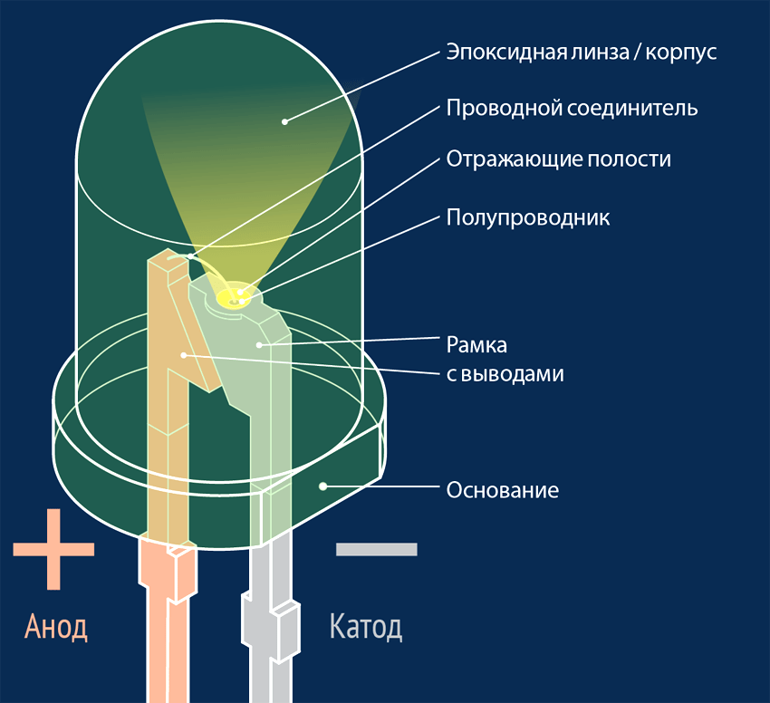
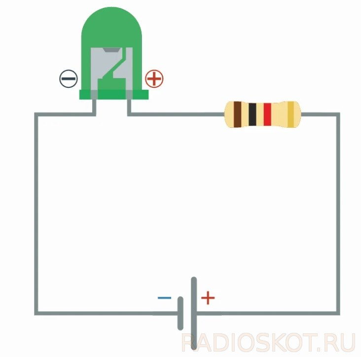
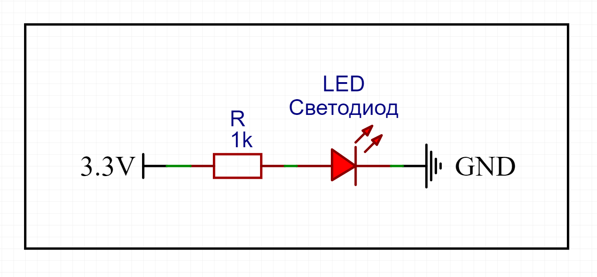
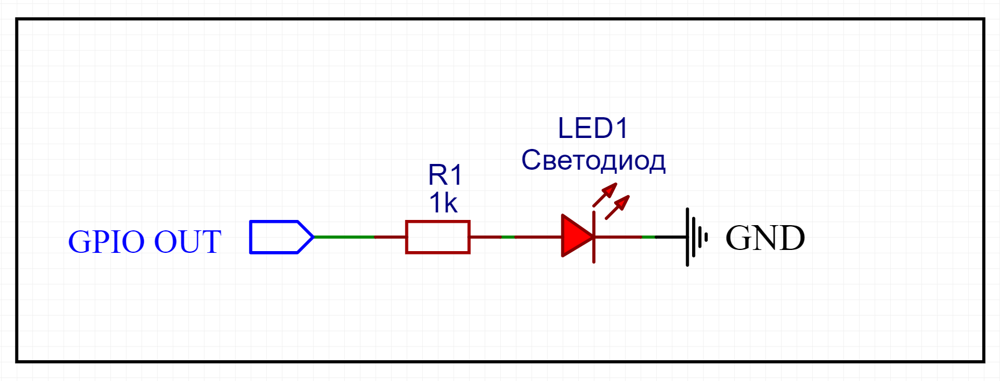
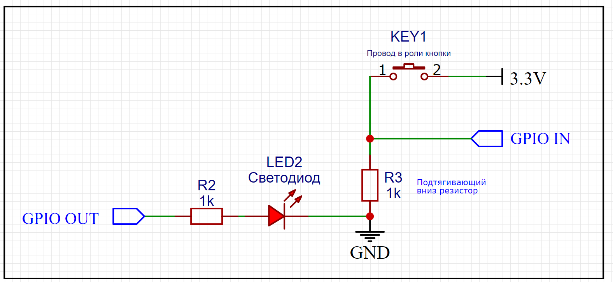

# Первое занятие. GPIO

Как известно, первая программа, которую человек пишет при изучении программирования, называется «Hello, World!». Смысл в том, чтобы научиться "распечатывать" данную фразу (выводить в терминал) при запуске скрипта. После успешного освония уже можно переходить к более сложному синтаксису языка, подходам и концепциям программирования.

В мире инженерии подобной отправной задачей смело можно назвать зажигание светодиода. Другими словами, нам в первую очередь необходимо научиться управлять включением и выключением светодиода, который можно рассматривать как простейший аналоговый прибор. Мы начнем с того, что соберем электрическую схему из токоограничивающего резистора и светодиода, запитаем ее от постоянного напряжения, тогда светодиод должен будет засветиться. Когда мы разомкнем цепь - светодиод погаснет.

Где мы возьмем этот источник напряжения? В этом нам поможет особый компьютер - Raspberry Pi - у которого есть выводы постоянного напряжения в 3.3 и 5 В.

Следующий уровень - научиться управлять диодом без необходимости руками переключать состояния схемы. Для этого мы напишем на языке Python скрипт, который будет управлять подачей и отключением напряжения в цепи по правилам, которые мы зададим в виде инструкций. Как же быть с источником напряжения в данном случае? Здесь мы столкнемся с такой вещью как порты ввода/вывода общего назначения, которые мы сможем использовать для подачи разного напряжения в цепь. 

## Цели и структура занятия
---
Познакомиться с Raspberry Pi и начать работу с GPIO

## Теоретическое введение
---

Давайте подробно разберемся с каждым из новых терминов, которые встретились выше.

Светоизлучающий диод (англ. light-emitting diode, LED)
: устройство, которое представляет собой полупроводниковый прибор, способный излучать свет при пропускании через него электрического тока в прямом направлении (от анода к катоду). 

Самая распространённый вид диода состоит из полимерного корпуса с линзой, медного или алюминиевого основания, катода, параболического рефлектора (отражателя) и полупроводникового кристалла, который соединяется с анодом при помощи тонкой золотой проволоки.

Принцип работы диода основывается на взаимодействии двух полупроводников, положительного и отрицательного типа (p-n-переход). P-n переход создается при соединении двух полупроводников разного типа электропроводности. Материал n-типа легируется электронами, p-типа – дырками.  При подаче напряжения электроны и дырки в p-n-переходе начинают перемещаться и занимать места. Когда носители заряда подходят к электронно-дырочному переходу, электроны помещаются в материал p-типа. В результате перехода электронов с одного энергетического уровня на другой выделяются фотоны - спонтанное излучение, которое мы наблюдаем в виде свечения в оптическом диапазоне.

> Цвет излучения светодиода зависит исключительно от ширины запрещенной зоны, в которой рекомбинируют электроны и дырки, то есть от материала полупроводника, и от легирующих примесей. Чем больше ширина запрещенной зоны и выше энергия квантов, тем ближе к синему излучаемый свет. Путем изменения состава можно добиться свечения в широком оптическом диапазоне – от ультрафиолета до среднего инфракрасного излучения. Светодиоды инфракрасного, красного и желтого цветов изготавливаются на основе фосфида галлия, зеленый, синий и фиолетовый – на основе нитридов галлия.
>> Помимо обычных одноцветных светодиодов бывают еще двух, и даже трехцветные. У них также один катод, а вот число анодов соответствует числу разных цветов.

На схеме светодиод обозначается как обычный диод с двумя параллельными стрелками, направленными наружу и указывающими на его излучающий характер.

Для того чтобы правильно включить светодиод в электрическую цепь, важно уметь определять полярность источника света. Полярность – это способность пропускать электрический ток в одном направлении. При неправильном включении светодиод может сломаться. А чтобы определить  полярность, необходимо отличать катод от анода. Сделать это можно либо по технической документации, либо визуально по нескольким признакам:

- Анод светодиода имеет более длинный проводник.
- Со стороны катода корпус светодиода немного срезан.

Также вы можете узнать полярность с помощью мультиметра. Прибор устанавливают в режим «Прозвонка». Красный и черный щупы устанавливают на выводы. Если диод засветился, значит красный щуп был подключен к аноду, а черный – к катоду. Если свечение не возникло, значит надо поменять положение щупов. Если результат не изменился (свечение отсутствует), вероятно диод вышел из строя.

> В современной микроэлектронике применяются миниатюрные светодиоды для поверхностного монтажа. Светодиоды типа  SMD имеют метки, указывающие на полярность. Они называются скосом или ключом, который направлен на отрицательный электрод. На маленькие smd наносятся пиктограммы в виде треугольника, буквы Т или П. Угол или выступ указывают на направление тока – значит, этот вывод является минусом. Также некоторые светодиоды могут иметь метку, которая указывает на полярность. Это может быть точка, кольцевая полоска.
>> Такие светодиоды есть и на Raspberry Pi, сможете найти их?

Диод имеет малое внутреннее сопротивление. При подключении его напрямую к блоку питания, элемент перегорит. Чтобы этого не случилось, светодиод подключается к батарейке или аккумулятору с помощью включения в схему маломощного резистора. Функция резистора – ограничение тока, протекающего через p-n-переход, определенным значением.

Как же выбрать резистор, чтобы светодиод не сгорел? Нужно определить сопротивление резистора *R* и мощность *P*. Сопротивление :

$$
R = {U~питания~ -  U~паспорт.~\over I~ном.~}
$$

U~питания~ – напряжение электропитания (питание источника), В;
U~паспорт.~ – падение напряжения, паспортное значение напряжения для светодиода, В;
I~ном.~ – номинальный ток.

Типичное значение падения напряжения – 3.2 В. Также для каждого светодиода существуют максимально допустимые напряжения U~max~ и U~max~^обр^ – для прямого и обратного включений.
Обычно диоды рассчитаны на силу тока в 20 мА.

Также нужно определить его мощность. При малом рассеивании тепла устройство будет перегреваться и выйдет из строя. Это приведет к разрыву электрической цепи.  

GPIO
: Интерфейс ввода/вывода общего назначения (англ. general-purpose input/output)

GPIO-контакты не имеют специального назначения и, как правило, остаются неиспользованными. Идея состоит в том, что иногда может оказаться полезным иметь несколько дополнительных линий цифрового управления.

Любой из контактов GPIO может быть назначен (в программе) как входной или выходной контакт и использоваться для связи между компонентами компьютерной системы и различными периферийными устройствами. Это даёт возможность организовать дополнительные схемы, не создавая их с нуля. GPIO-контакты часто группируются в порты. Эти порты позволяют собирать данные с датчиков, управлять двигателями, ключами, реле и прочими устройствами с помощью программных инструкций.

Raspberry Pi
: одноплатный компьютер размером с банковскую карту, разработанный британской компанией Raspberry Pi Foundation как бюджетная система для обучения информатике, но позже получивший более широкое применение и известность

Raspberry Pi является полноценным компьютером, хотя и менее быстрым и мощным. Зато он может делать одну вещь гораздо более эффективно, чем любой домашний компьютер - благодаря ряду контактов GPIO вдоль верхнего края платы он может управлять внешними устройствами. Устройства могут быть абсолютно любыми, от обычной лампочки, до беспилотного летательного аппарата. В данном случае область применения Raspberry ограничена лишь вашей фантазией и знаниями. 

> На официальном сайте есть туториалы, как собрать ... На странице новостей постоянно публикаются новые оригинальные проекты, построенные на базе малинок https://www.raspberrypi.com/news/

40-контактный разъем GPIO имеется на всех современных платах Raspberry Pi (кроме некоторых моделей Raspberry Pi Zero). До Raspberry Pi 1 Model B+ (2014) платы имели более короткий 26-контактный разъем. Разъем GPIO на всех платах имеет шаг контактов 0,1 дюйма (2.54 мм).

> ⚠️ Нумерация контактов GPIO не соответствует физической последовательности пинов.

Каждый пин GPIO имеет несколько "имен"; первое и самое очевидное относится к «физическому» расположению на плате. Начиная с левого верхнего угла (с контакта, ближайший к тому месту, где вставлена ​​карта micro SD), у нас есть физический контакт 1, который обеспечивает питание постоянное напряжение 3.3 В. Справа от этого контакта находится физический контакт 2, который обеспечивает питание 5 В. Затем номера контактов увеличиваются по мере продвижения вниз по каждому столбцу, при этом контакт 1 переходит в контакт 3, 5, 7 и т. д., пока мы не достигнем контакта 39. Вы быстро увидите, что каждый контакт с 1 по 39 в этом столбце соответствует нечетной последовательности чисел. И для столбца, начинающегося с контакта 2, он будет идти 4,6,8 и т. д., пока не достигнет 40. Следуя четной последовательности чисел. Физическая нумерация контактов — это самый простой способ найти контакт, но многие учебные пособия, написанные для Raspberry Pi, следуют другой последовательности нумерации. Нумерация контактов Broadcom (BCM) (также известная как номер контакта GPIO)

Нумерация контактов Broadcom (BCM) сначала может показататься хаотичной. Отображение контактов BCM относится к контактам GPIO, которые были напрямую подключены к системе на кристалле (SoC) Raspberry Pi. По сути, у нас есть прямые связи с мозгом нашего Pi для подключения датчиков и компонентов для использования в наших проектах.

Доступ к наглядной справке по GPIO можно получить на Raspberry Pi, открыв окно терминала и выполнив команду `pinout`.

Также можно воспользоваться интерактивным справочником [pinout.xyz](https://pinout.xyz/). Кроме того, на рабочих столах каждой малинки лежит схема распиновки.

> ⚠️ Не все 40 контактов доступны для программирования. На самом деле для программирования доступны только 26 контактов ввода/вывода (GPIO), которые имеют номера от GPIO2 до GPIO27.

Контакты GPIO являются цифровыми, это означает, что они могут иметь два состояния: выключено или включено. Они могут иметь направление для приема или отправки тока (ввод, вывод соответственно), и мы можем контролировать состояние и направление выводов, используя такие языки программирования, как Python, JavaScript, node-RED и т. д.

##### Напряжение
На плате присутствуют два контакта 5 В и два контакта 3.3 В, а также несколько контактов заземления (0 В), которые не настраиваются. Все остальные контакты являются пинами общего назначения на 3.3 В, что означает, что выходы способны выдавать напряжение в 3.3 В, а входы устойчивы к подаче 3.3 В.
##### Выходы
Контакт GPIO, используемый как выходной, может быть настроен на высокое значение напряжения (HIGH = 3.3 В) или на низкое (LOW = 0 В).

- Получаемые уровни напряжений: 0В и +3.3В (не +5В, от которых питается малинка)
- Максимальный ток: 2 - 16мА (по умолчанию 8мА)
- Максимальный суммарный ток нагрузки для всех задействованных пинов GPIO - 50мА

##### Входы
Вывод GPIO, обозначенный как входной, может считывать либо высокое значение напряжения(3.3 В), либо низкое (0 В). 

- Максимально допустимое напряжение равно +3.3В
- Уровень логической единицы (1) начинается примерно с напряжения +1.8В
- максимальный ток 0.5 мА

Это упрощается за счет использования внутренних подтягивающих вверх или вниз резисторов. Контакты GPIO2 и GPIO3 имеют фиксированные подтягивающие вверх резисторы, но для остальных пинов подобное поведение можно настроить программно.

##### Кроме того
Помимо простых устройств ввода и вывода, контакты GPIO могут использоваться с множеством альтернативных функций (последовательный порт, интерфейсы SPI и I^2^С и т.д.), некоторые доступны для всех контактов, другие — только для определенных пинов.

- PWM (pulse-width modulation)
    - Программный ШИМ доступен для всех пинов
    - Хардварный ШИМ доступен на GPIO12, GPIO13, GPIO18, GPIO19

- SPI
    - SPI0: MOSI (GPIO10); MISO (GPIO9); SCLK (GPIO11); CE0 (GPIO8), CE1 (GPIO7)
    - SPI1: MOSI (GPIO20); MISO (GPIO19); SCLK (GPIO21); CE0 (GPIO18); CE1 (GPIO17); CE2 (GPIO16)

- I^2^C
    - Data: (GPIO2); Clock (GPIO3)
    - EEPROM Data: (GPIO0); EEPROM Clock (GPIO1)

- Serial
    - TX (GPIO14); RX (GPIO15)

Если не учитывать контакты, которые могут выполнять специальные функции, то остается 17 программируемых контактов общего назначения

## Практика программирования на Python
---
Для выполнения второго и третьего заданий потребуется писать код на Python. Для этого нам понадобятся непосредственно интерпретатор Python и любой редактор кода.

Python предварительно загружен в ОС Raspberry Pi. Для работы с ним мы предлагаем использовать бесплатный кроссплатформенный редактор кода *Visual Studio Code*, который включает в себя отладчик (debugger, помогает искать ошибки в коде), инструменты для работы с *Git* (с ним мы скоро познакомимся), подсветку синтаксиса, технологию автодополнения (когда вы начинаете писать название, а программа вам подсказывает варианты продолжения) и средства для рефакторинга (переработки кода). 

Мы установили на каждый компьютер *VS Code*, найти его можно во вкладке **Programming**, в которую вы попадаете из меню, нажав на значок «Малинки» (<a href=#VS>см. скриншот</a>). Там же находятся другие предустановленные редакторы кода и IDE, например, *Thonny Python IDE* — интегрированная среда разработки для Python, предназначенная для начинающих, и *Geany* — среда разработки программного обеспечения, написанная с использованием библиотеки *GTK+*.

<figure>
    <a name = "VS">
    
    <figcaption><i>Где искать редакторы кода и IDE</i></figcaption>
    </a>
</figure>

Для первого занятия вам потребуется научиться (или вспомнить, как)
- [ ] создавать скрипты,
- [ ] сохранять скрипты,
- [ ] запускать скрипты,
- [ ] импортировать модули (`time`, `RPi.GPIO`),
- [ ] вызывать методы из импортированных модулей,
- [ ] использовать горячие клавиши в процессе работы.

Давайте кратко рассмотрим каждый из пунктов. Все примеры буду рассматриваться в редакторе VS Code. 

##### Создание скрипта
Есть несколько способов создать скрипт. Давайте рассмотрим два самых удобных для нас варианта:
1. Через проводник. Откройте проводник (нажмите на иконку с папочками), найдите папку Documents, нажмите правой кнопкой мыши на пустое место и выберите New File. В открывшемся окне введите желаемой название файла, через точку укажите расширение файла. Если вы хотите создать скрипт пайтон, то расширение будет `.py`.
2. Через VS Code. Запустите VS Code, наверху найдите и кликните на File, выберите Open Folder (открыть папку). В открывшемся окне выберите директорию Documents. После того, как в VS Code откроется нужная папка, вы увидите ее имя слева в списке Open Editors. Там же есть иконка файл с плюсиком, кликните на нее, чтобы создать новый файл. Введите имя и нажмите Enter.
##### Сохранение скрипта

Сохранить скрипт можно через кнопку *File->Save* или с помощью комбинации клавиш `Ctrl + S`

##### Запуск скрипта

Прежде чем запустить скрипт, убедитесь, что фаш файл нужного формата. В VS Code в правом нижнем углу указан тип открытого файла: если вы видите Plain Text, вместо Python, то нажмите на это слово и в открышемся меню найдите Python. Либо пересохраните файл, не забыв указать расширение через точку.

После этого найдите кнопку Run с иконкой зеленой стрелочки и нажмите на нее. 

Продвинутые пользователи могут запускать скрипты через терминал по имени файла. Для этого нужно перейти в папку с файлом с помощью `cd Documents` и вызвать команду:
 
    python my_script.py

Либо, не переходя в нужную директорию, указать не относительный путь, а абсолютный.

##### Импорт модулей
Подключить модуль можно с помощью инструкции `import`. После ключевого слова `import` указывается название модуля. После импортирования модуля его название становится переменной, через которую можно получить доступ к атрибутам модуля.

    import math #это библиотека с математическими функциями

Если название модуля слишком длинное, или оно вам не нравится по каким-то другим причинам, то для него можно создать псевдоним с помощью ключевого слова `as`.

    import math as m

##### Вызов методов и атрибутов из импортированных модулей

Чтобы импортировать метод, необходимо сначала указать название модуля, откуда будет производиться импорт, затем поставить точку, после чего написать название функции и не забыть круглые скобки для аргументов.

    import time
    current_time = time.time()

Здесь мы импортировали модуль `time`,  у которого есть метод `time()`, возвращающий текущее время. Да, названия модулей и функций могут совпадать.
> :bulb: Чтобы не запутаться, можно импортировать только необходимые методы, тогда название модуля указывать будет не нужно.

    from time import time
    current_time = time()

Атрибуты импортируются аналогично, но после их имен не нужно ставить круглые скобки, так как это не функции. Например, получим значение константы π и распечатаем значение с помощью встроенной функции `print()`.

    import math as m
    print(m.pi)

[Библиотека `RPi.GPIO`](https://sourceforge.net/p/raspberry-gpio-python/wiki/BasicUsage/) написана специально для управления портами GPIO на языке Python. Перейдите по ссылке и просмотрите внимательно примеры ее использования. Мы будем импортировать данный модуль под псевдонимом GPIO, чтобы было удобнее обращаться к ее методам.

    import RPi.GPIO as GPIO
    GPIO.setmode(GPIO.BCM)

##### Полезные комбинации клавиш

`Ctrl + F5` - запустить исполнение скрипта
`Ctrl + C` - прервать исполнение скрипта
`Ctrl + Shift + C` - скопировать
`Ctrl + Shift + V` - вставить
`Ctrl + ⬅️` - переместиться налево через слово
`Ctrl + Shift + ⬅️` - выделить предыдущее слово
`Tab` - вызвать автодополнение

## Оборудование и инструменты
---
Нам понадобятся
: Raspberry Pi, монитор, устройства ввода, учебная плата, макетная плата, светодиод, 2 резистора по 1 кОм, соединительные провода, мультиметр

Прежде чем приступать к выполнению заданий, убедитесь, что на вашем рабочем месте есть все необходимое оборудование и компоненты.

> Проверьте, что в малинку вставлена карта памяти microSD. Она используется для хранения информации в энергонезависимом режиме и является аналогом жесткого диска в обычных ПК. На карте памяти хранятся файлы и папки операционной системы, установленного программного обеспечения и скоро будут храниться ваши файлы.

### Включаем компьютер

> ⚠️ Raspberry Pi не имеет выключателя питания и включается сразу же после присоединения разъема питания.
>> :bulb: Будем вставлять вилку источника питания в сетевую розетку только после подключения всей периферии.

В первую очередь нужно подключить клавиатуру и мышь к Raspberry Pi, как вы могли заметить, у компьютера есть 4 USB-разъема, в любые из которых можно подключать устройства ввода (input devices).

Следующий шаг — монитор. Малинка поддерживает подключение двух мониторов, если монитор один (как у нас) — важно подключить его в нужный разъем. Найдите ближайший к питанию разъем micro-HDMI у компьютера и HDMI-разъем сзади монитора, соедините их кабелем с одним разъемом micro-HDMI одним полноразмерным HDMI.

Опциональный шаг — интернет. Для подключения микрокомпьютера к сети с использованием сетевого кабеля (Ethernet cable) возьмите кабель и вставьте его разъем в сетевой порт (Ethernet port) с пластиковым фиксатором, направленным вниз к плате до характерного щелчка, говорящего о том, что кабель зафиксирован. Для извлечения кабеля просто прижмите фиксатор в направлении к кабелю и аккуратно вытащите кабель из разъема. Второй разъем сетевого кабеля уходит в пластиковый короб на стене, откуда идет к порту роутера. 
> :memo: В кабинете есть WiFi, но из-за большой одновременной нагрузки сайты очень медленно грузятся, так что не спрашивайте у нас пароль от WiFi - мы будем использовать Ethernet.

Необязательный шаг - наушники. У малинки есть звуковая карта, поэтому вы можете выводить звук, например, подключив проводные наушники в 3,5-миллиметровый TRS-разъем (stereo Jack).

Последний шаг - питание. Для работы с малинкой нужно включить адаптер питания в электрическую сеть и подключить к компьютеру штекером USB Type-C, но сначала сверьтесь с картинкой ниже: салатовый провод — кабель Ethernet, малиновые провода — USB - мышь и клавиатура, темно-бирюзовый провод — наушники (необязательный пункт), дальше идут два белых провода к мониторам (у нас один  —  только левый провод, ближайший к Type-С разъему). 

Если все правильно, то подключите самый последний белый провод — провод питания, и ваша малинка оживет! Когда компьютер запитан, на его передней панели светятся светодиоды. Если вы не видите мигающие огоньки, значит, нужно еще раз проверить питание.

### Возможные проблемы с Raspberry Pi и их решения

> 😰 Компьютер не включается

Либо вы не подключили его к питанию, либо он все же включен, и проблема с монитором. Убедитесь, что на малинке мигают светодиоды, затем, что монитор и компьютер соединены проводом. После чего посмотрите на кнопку включения монитора, если она не светится, значит, монитор выключен.
> 🤔 Картинка на экране растянута / сжата / непропорционально выглядит

Скорее всего вы подключили micro-HDMI во второй разъем, переключите на первый. Если это не помогло, то есть вероятность, что кто-то менял настройки монитора. Рядом с кнопкой включения монитора находятся кнопочки поменьше, понажимайте их, вы быстро разберетесь, за что отвечает каждая. Найдите пункт разрешение экрана
> 😵‍💫 Не работает клавиатура или мышь

А вы их точно подключили к компьютеру? Нет-нет, не к монитору, к малинке. Если вы хотите подключать внешние устройства через USB-хаб монитора, то вообще это возможно, но для передачи сигнала от мыши и клавиатуры к компьютеру нужен еще один провод USB, который соединит монитор и компьютер. У нас такой опции нет

> 🤯 На черном экране висит какая-то ошибка

Такое происходит, если вы включаете малинку до того, как подключили монитор. Отсоедините провод питания и через пару секунд подключите его обратно.

## Задания
---

> 🚫 НЕ ИСПОЛЬЗУЙТЕ ПИТАНИЕ 5В ДЛЯ СВОИХ СХЕМ 🚫

### Задача №1 Зажечь светодиод
- Собрать на макетной плате схему из светодиода и резистора 1кОм
- Подключить схему двумя проводами "мама-папа" к портам Raspberry Pi с питанием 3.3В и GND
- При подключении Raspberry Pi к питанию (USB-C) светодиод должен светиться

Схема к заданию:

### Задача №2 Поморгать светодиодом
Доработать схему из первого задания:
-	Подключить светодиод к любому GPIO-пину
-	Написать Python-скрипт, который моргает светодиодом. Для этого в скрипте:
    - Настроить выбранный GPIO-пин, как выход
    - Подать на выбранный GPIO-пин единицу
    - Подождать
    - Подать на выбранный GPIO-пин ноль
    - Подождать
    - Повторить несколько раз копированием без цикла for

Подсказки:
- Для работы с GPIO подключить модуль `RPi.GPIO`
- Для пауз в скрипте подключить модуль [`time`](https://docs.python.org/3/library/time.html#time.sleep) и использовать его функцию `time.sleep(secs)`: 

Схема к заданию:

### Задача №3 Отобразить состояние входа светодиодом
Доработать схему из второго задания:
- Подтянуть к GND через 1кОм любой GPIO-пин
- Подключить провод "мама-папа" к порту Raspberry Pi с питанием 3.3V (провод в роли "кнопки")
- Написать Python-скрипт, который при запуске включает светодиод, если на входе 3.3V и выключает, если 0.0V:
    - Не использовать цикл `while` или `for`
    - Настроить один выбранный GPIO-пин как вход
    - Настроить другой выбранный GPIO-пин как выход
    - Считать значение со входа
    - Подать считанное значение на выход

Схема к заданию:

## После выполнения заданий
---
==Выключите компьютер==: нажмите на малинку, чтобы перейти в основное меню, нажмите на пункт **Shutdown** с иконкой человечка для выключения, в опциях выключения выберите либо также **Shutdown** (выключиться), либо **LogOut** (разлогиниться).

==Соберите провода, резисторы и прочие компоненты в коробочку==. Аккуратно расставьте на столе.
## Подведем итоги

Чему мы научились

First Header  | Second Header
------------- | -------------
Content Cell  | Content Cell
Content Cell  | Content Cell

## Для любознательных
Предлагаем вам самостоятельно подумать и поискать ответы на следующие вопросы:
- Чем отличается редактор кода от интегрированной среды разработки?
- Как устроен транзистор?
- Как подключить к Raspberry Pi монитор, у которого нет HDMI-разъема?
- Что такое wildcard import в Python?
- Как сделать модуль из своего скрипта?

## Видео к занятию

## Полезные ссылки

https://www.raspberrypi.com/documentation/computers/raspberry-pi.html#raspberry-pi-4-model-b

