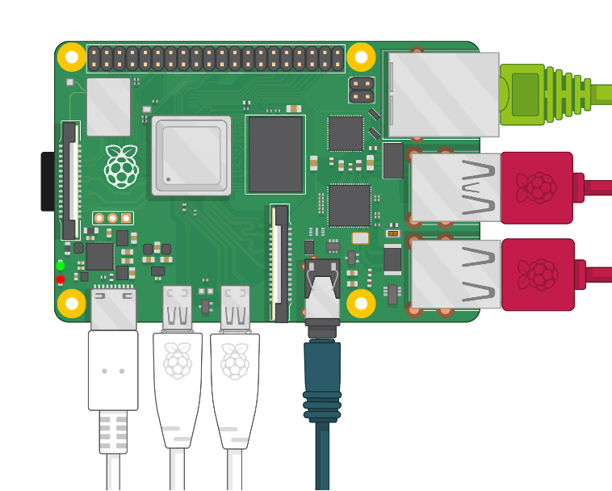

# Первое занятие. GPIO
## Цели и структура занятия
---
Познакомиться с Raspberry Pi и начать работу с GPIO
## Теория
---
Что такое GPIO?

term
: definition

Эти порты позволяют собирать данных с датчиков, управлять двигателями, ключами, реле и прочими устройствами с помощью программы.

## Практика программирования на Python
---
Для выполнения второго и третьего заданий потребуется писать код на Python. Для этого нам понадобятся непосредственно интерпретатор Python и любой редактор кода.

Python предварительно загружен в ОС Raspberry Pi. Для работы с ним мы предлагаем использовать бесплатный кроссплатформенный редактор кода *Visual Studio Code*, который включает в себя отладчик (debugger, помогает искать ошибки в коде), инструменты для работы с *Git* (с ним мы скоро познакомимся), подсветку синтаксиса, технологию автодополнения (когда вы начинаете писать название, а программа вам подсказывает варианты продолжения) и средства для рефакторинга (переработки кода). 

Мы установили на каждый компьютер *VS Code*, найти его можно во вкладке **Programming**, в которую вы попадаете из меню, нажав на значок «Малинки» ([Рисунок 1](#programming)). Там же находятся другие предустановленные редакторы кода и IDE, например, *Thonny Python IDE* — интегрированная среда разработки для Python, предназначенная для начинающих, и *Geany* — среда разработки программного обеспечения, написанная с использованием библиотеки *GTK+*.

*Рисунок 1 - Где искать редакторы кода и IDE*

Для первого занятия вам потребуется научиться (или вспомнить, как)
- [ ] создавать скрипты,
- [ ] сохранять скрипты,
- [ ] запускать скрипты,
- [ ] импортировать модули (`time`, `RPi.GPIO`),
- [ ] вызывать методы из импортированных модулей.

Давайте кратко рассмотрим каждый из пунктов. 

### Создание скрипта
Есть несколько способов создать скрипт
### Импорт модулей
Подключить модуль можно с помощью инструкции `import`. После ключевого слова `import` указывается название модуля. После импортирования модуля его название становится переменной, через которую можно получить доступ к атрибутам модуля.

    import math #это библиотека с математическими функциями

Если название модуля слишком длинное, или оно вам не нравится по каким-то другим причинам, то для него можно создать псевдоним с помощью ключевого слова `as`.
```
import math as m
```

### Вызов методов и атрибутов из импортированных модулей

Чтобы импортировать метод, необходимо сначала указать название модуля, откуда будет производиться импорт, затем поставить точку, после чего написать название функции и не забыть круглые скобки для аргументов.

    import time
    current_time = time.time()

Здесь мы импортировали модуль `time`,  у которого есть метод `time()`, возвращающий текущее время. Да, названия модулей и функций могут совпадать.
> :bulb: Чтобы не запутаться, можно импортировать только необходимые методы, тогда название модуля указывать будет не нужно.

    from time import time
    current_time = time()

Атрибуты импортируются аналогично, но после их имен не нужно ставить круглые скобки, так как это не функции. Например, получим значение константы π и распечатаем значение с помощью встроенной функции `print()`.

    import math as m
    print(m.pi)

[Библиотека `RPi.GPIO`](https://sourceforge.net/p/raspberry-gpio-python/wiki/BasicUsage/) написана специально для управления портами GPIO на языке Python. Перейдите по ссылке и просмотрите внимательно примеры ее использования. Мы будем импортировать данный модуль под псевдонимом GPIO, чтобы было удобнее обращаться к ее методам.

    import RPi.GPIO as GPIO
    GPIO.setmode(GPIO.BCM)


## Оборудование и инструменты
---
Raspberry Pi, монитор, устройства ввода, учебная плата, макетная плата, светодиод, 2 резистора 1 КОм, соединительные провода, мультиметр

Прежде чем приступать к выполнению заданий, убедитесь, что на вашем рабочем месте есть все необходимое оборудование и компоненты. 
Для начала проверьте, что в малинку вставлена карта памяти microSD. Она используется для хранения информации в энергонезависимом режиме и является аналогом жесткого диска в обычных ПК. На карте памяти хранятся файлы и папки операционной системы, установленного программного обеспечения и скоро будут храниться ваши файлы. 
Для работы с малинкой нужно включить адаптер питания в электрическую сеть и подключить к компьютеру штекером USB Type-C . Когда компьютер запитан, светодиоды на его передней панели светятся. Если вы не видите мигающие огоньки, значит, нужно еще раз проверить питание.
> Обратите внимание! Raspberry Pi не имеет выключателя питания и включается сразу же после присоединения разъема питания. 
>> :bulb: Будем вставлять вилку источника питания в сетевую розетку только после подключения всей периферии.

В первую очередь нужно подключить клавиатуру и мышь к Raspberry Pi, обратите внимание, что у компьютера есть 4 USB-разъема, к любым из которых можно подключать устройства ввода (input devices).

Следующий шаг — монитор. Малинка поддерживает подключение двух мониторов, если монитор один (как у нас) — важно подключить его в нужный разъем. Найдите ближайший к питанию разъем micro-HDMI у компьютера и HDMI-разъем сзади монитора, соедините их кабелем с одним разъемом micro-HDMI одним полноразмерным HDMI.

Последний шаг — интернет. Для подключения микрокомпьютера к сети с использованием сетевого кабеля (Ethernet cable) возьмите кабель и вставьте его разъем в сетевой порт (Ethernet port) с пластиковым фиксатором, направленным вниз к плате до характерного щелчка, говорящего о том, что кабель зафиксирован. Для извлечения кабеля просто прижмите фиксатор в направлении к кабелю и аккуратно вытащите кабель из разъема. Второй разъем сетевого кабеля уходит в пластиковый короб на стене, откуда идет к порту роутера. 
> :memo: В кабинете есть WiFi, но из-за большой одновременной нагрузки сайты очень медленно грузятся,  так что мы будем использовать Ethernet.

У малинки есть звуковая карта, поэтому вы можете выводить звук, например, подключив проводные наушники в 3,5-миллиметровый разъем (mini-Jack).

Сверьтесь с картинкой (*Рисунок 2*): салатовый провод — кабель Ethernet, малиновые провода — USB - мышь и клавиатура, темно-бирюзовый провод — наушники (необязательный пункт), дальше идут два белых провода к мониторам (у нас один  —  только левый провод, ближайший к Type-С разъему). Если все правильно, то подключите самый последний белый провод — провод питания, и ваша малинка оживет!


*Рисунок 2 - Иллюстрация того, как подключать к малинке периферийные устройства*

### Возможные проблемы и их решения:

> 😰 Компьютер не включается

Либо вы не подключили его к питанию, либо он все же включен, и проблема с монитором. Убедитесь, что на малинке мигают светодиоды, затем, что монитор и компьютер соединены проводом. После чего посмотрите на кнопку включения монитора, если она не светится, значит, монитор выключен.
> 🤔 Картинка на экране растянута / сжата / непропорционально выглядит

Скорее всего вы подключили micro-HDMI во второй разъем, переключите на первый. Если это не помогло, то есть вероятность, что кто-то менял настройки монитора. Рядом с кнопкой включения монитора находятся кнопочки поменьше, понажимайте их, вы быстро разберетесь, за что отвечает каждая. Найдите пункт разрешение экрана
> 😵‍💫 Не работает клавиатура или мышь

А вы их точно подключили к компьютеру? Нет-нет, не к монитору, к малинке. Если вы хотите подключать внешние устройства через USB-хаб монитора, то вообще это возможно, но для передачи сигнала от мыши и клавиатуры к компьютеру нужен еще один провод USB, который соединит монитор и компьютер. У нас такой опции нет

> 🤯 На черном экране висит какая-то ошибка

Такое бывает, когда вы включили малинку раньше, чем подключили монитор. Отсоедините провод питания и через пару секунд подключите его обратно.

## Задания
---
### **Задача №1** Зажечь светодиод
- Собрать на макетной плате схему из светодиода и резистора 1кОм
- Подключить схему двумя проводами "мама-папа" к портам Raspberry Pi с питанием 3.3В и GND
- При подключении Raspberry Pi к питанию (USB-C) светодиод должен светиться

### **Задача №2** Поморгать светодиодом
Доработать схему из первого задания:
-	Подключить светодиод к любому GPIO-пину
-	Написать Python-скрипт, который моргает светодиодом. Для этого в скрипте:
    - Настроить выбранный GPIO-пин, как выход
    - Подать на выбранный GPIO-пин единицу
    - Подождать
    - Подать на выбранный GPIO-пин ноль
    - Подождать
    - Повторить несколько раз копированием без цикла for

Подсказки:
- Для работы с GPIO подключить модуль `RPi.GPIO`
- Для пауз в скрипте подключить модуль [`time`](https://docs.python.org/3/library/time.html#time.sleep) и использовать его функцию `time.sleep(secs)`: 

Схема к заданию:
### **Задача №3** Отобразить состояние входа светодиодом
Доработать схему из второго задания:
- Подтянуть к GND через 1кОм любой GPIO-пин
- Подключить провод "мама-папа" к порту Raspberry Pi с питанием 3.3V (провод в роли "кнопки")
- Написать Python-скрипт, который при запуске включает светодиод, если на входе 3.3V и выключает, если 0.0V:
    - Не использовать цикл `while` или `for`
    - Настроить один выбранный GPIO-пин как вход
    - Настроить другой выбранный GPIO-пин как выход
    - Считать значение со входа
    - Подать считанное значение на выход

Схема к заданию:

## После выполнения заданий
---
==Выключите компьютер==: нажмите на малинку, чтобы перейти в основное меню, нажмите на пункт **Shutdown** с иконкой человечка для выключения, в опциях выключения выберите либо также **Shutdown** (выключиться), либо **LogOut** (разлогиниться).

==Соберите провода, резисторы и прочие компоненты в коробочку==. Аккуратно расставьте на столе.
## Подведем итоги

Чему мы научились

First Header  | Second Header
------------- | -------------
Content Cell  | Content Cell
Content Cell  | Content Cell


## Для любознательных
Предлагаем вам самостоятельно почитать в интернете 
-	Чем отличается редактор кода от интегрированной среды разработки
-	Как устроен транзистор
-	Как подключить к Raspberry Pi монитор, у которого нет HDMI-разъема
-	Импорт в Питоне

* [Server Requirements](#server-requirements)
* [Installation](#installation-in-4-steps)
* [Configuration](#Configuration)


## Server Requirements
---------------------

* PHP >= 7.1.0
* PDO PHP Extension

## Installation in 4 steps